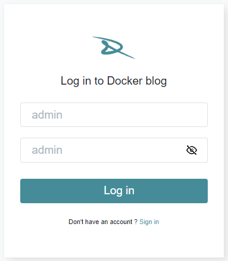

# Docker blog

This mini-blog is a project I realized after my first course on Docker.


## How does it work?

### Installation
 1. Clone the repository
 ```sh
  git clone https://github.com/Numyu/docker-blog.git
  ```
2. Open docker desktop
- Enter this command, to start the containers in the background :
```sh
  docker compose up -d
  ```
- Enter this command, to stop the containers :
```sh
  docker compose down
  ```

### Usage
- If you want to see the database, go to :
```sh
  localhost:1333
  ```
- Connect to the adminer
```sh
  System = MySQL
  Server = database
  User = root 
  Password = password 
  Database = data
  ```

- If you want to see the mini-blog, go to :
```sh
  localhost:2345
  ```
- By default, an Administrator account is created, but you can create your own account to try.



## Build With
- 
- 
## Contact
- [Billy IEA](https://www.linkedin.com/in/billy-iea/)
